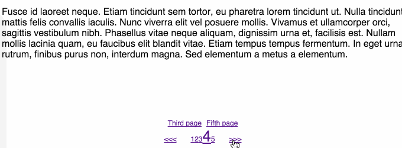

# react-shift
A paginated "carousel-like" component for [JSX](https://facebook.github.io/react/docs/jsx-in-depth.html) elements. Can be used to serve pages of content or dropped as a small component into a larger stack.

Currently hard-swaps content, so smooth scrolling/sliding can only be simulated using `ReactCSSTransitionGroup`.

## Installation
```
npm install react-shift --save
```

## Getting started
```js
render(
  <Shift>
    <div>First page</div>
    <div>Second page</div>
    <div>Third page</div>
  </Shift>,
  node
);
```

## Props
The component can be passed objects as props to customize the navigation and page elements.

Name | Type | Properties | Description | Default
------------- | ------------- | ------------- | ------------- | -------------
`arrowLabels` | *object* | `next`, `previous` | Specifies custom next and previous page link labels. | `{ next: 'Next page', previous: 'Previous page' }`
`fastLinks` | *object* | Custom key/value pairs each defining a fast links. |  Creates a shortcut link to a page, where the key is the link name and the value is the page index to link to. | `null`
`fakeLinks` | *boolean* | *N/A* |  Toggles psuedohyperlinking on naviation elements. | `true`
`transitions` | *object* | `active`, `name` | Used to activate and define [ReactCSSTransitionGroup](https://facebook.github.io/react/docs/animation.html) on the page subcomponent. | `null`
`classes` | *object* | `wrapper`, `navigation`, `page`, `pagination`, `pageNumber`<sup>1</sup>, `currentPage`, `fastLinks`, `navArrow`, `nextPage`, `previousPage`, `arrowFiller`<sup>2</sup> | Passes class names to subcomponent `className` properties. | `null`
`styles` | *object* | `wrapper`, `navigation`, `page`, `pagination`, `pageNumber`<sup>3</sup>, `currentPage`, `fastLinks`, `navArrow`, `nextPage`, `previousPage`, `arrowFiller`<sup>2</sup> | Passes styles to subcomponent `style` properties. | `null`
`scrollable` | *boolean* | *N/A* | **Experimental**, has problems on mobile devices. Specifies if mouse wheel scrolling events on the page subcomponent triggers page changes. | `false`

<sup>1</sup> `pageNumber` (className) applies that generic className *every* page number element, but also creates a unique class name on each page number using `${yourDefinedClass}-${pageIndex}`.

<sup>2</sup> `arrowFiller` can be used to override navArrow styling normally applied to the empty space reserved for page arrows.

<sup>3</sup> Unlike the `className` version, this prop does **not** currently offer unique styling for each page index number.

## Advanced example:
```js
const arrowLabels = {
  next: '>>>',
  previous: '<<<'
};

const fastLinks = {
  'Third page': 2,
  'Fifth page': 4
};

const classes = {
  navigation: 'react-shift-navigation',
  page: 'react-shift-page',
  pagination: 'react-shift-pagination',
  pageNumber: 'react-shift-page-number',
  currentPage: 'react-shift-current-page',
  fastLinks: 'react-shift-fast-link',
  navArrow: 'react-shift-nav-arrow',
  nextPage: 'react-shift-next-page',
  previousPage: 'react-shift-previous-page'
};

ReactDOM.render(
  <Shift
    classes={classes}
    arrowLabels={arrowLabels}
    fastLinks={fastLinks}
    transitions={transitions}
      <div>First page</div>
      <div>Second page</div>
      <div>Third page</div>
  </Shift>,
  document.getElementById('react-shift-anchor')
);
```

## Demo

`npm run demo`

Open `demo.html` in a browser.
